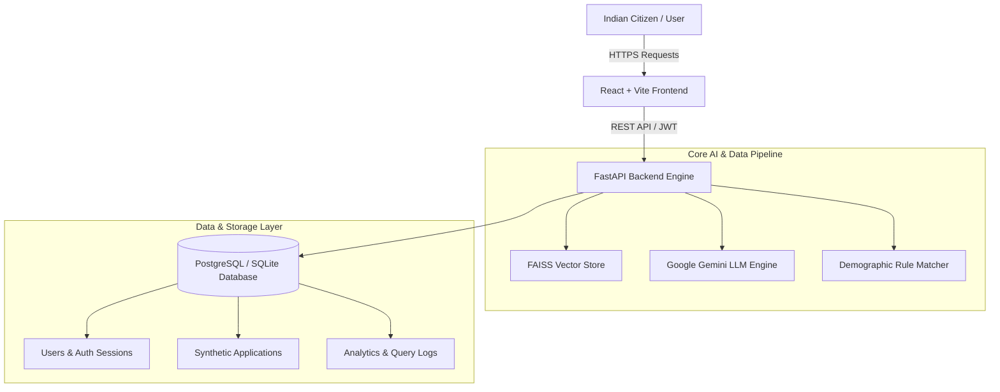

# 🇮🇳 JanSahay (जनसहाय) — Citizen-First AI Government Scheme Discovery & Application Platform

> **Build What Moves India Hackathon Project**  
> An intelligent, multilingual AI platform simplifying government scheme discovery, demographic eligibility matching, interactive document readiness checklists, and synthetic application tracking for over 1.4 billion Indian citizens.

---

[](https://fastapi.tiangolo.com/)
[](https://react.dev/)
[](https://vitejs.dev/)
[](https://tailwindcss.com/)
[](https://github.com/facebookresearch/faiss)
[](https://ai.google.dev/)
[](https://www.postgresql.org/)

---

## 🌟 Key Features

### 1. 🤖 **AI Assistant & Retrieval-Augmented Generation (RAG)**
- Built with **FAISS vector search** and **Google Gemini 1.5 Flash** (with fallback to rule-based indexing).
- Answers complex citizen queries like *"I am a small farmer in Gujarat looking for annual income support"* and immediately identifies relevant welfare schemes (e.g., **PM-KISAN**).

### 2. 🎯 **Demographic Eligibility Matcher**
- Multi-factor rule engine filtering by **Age, Gender, State, Occupation, Annual Income, and Caste Category**.
- Excludes non-matching student scholarships for working citizens over age 28.
- Provides direct **"Start Demo Application 📋"** actions on result cards.

### 3. 📋 **Interactive Synthetic Action Plans & Document Checklists**
- Step-by-step synthetic application wizard breaking down required government documents (*Aadhaar, Land Records, Bank Passbook, Self-Declarations*).
- Interactive checkboxes allow citizens to verify document readiness before applying.
- Generates synthetic tracking IDs (e.g., `JS-2026-410048`).

### 4. 🔒 **Multi-Tenant User Application Privacy**
- User data is isolated per authenticated account via JWT bearer tokens and PostgreSQL user-scoped storage.
- User A (`sam`) can never view User B (`Rahul Sharma`)'s applications or documents.
- Includes pre-hydrated JWT session persistence across page reloads.

### 5. 🌐 **7 Indian Languages & Accessibility**
- Full UI localization and query processing in **English, Hindi (हिंदी), Gujarati (ગુજરાતી), Tamil (தமிழ்), Telugu (తెలుగు), Bengali (বাংলা), and Marathi (मराठी)**.
- Integrated Web Speech API for voice-activated search input.

### 6. 🌓 **Pre-Hydrated Light & Dark Mode**
- Instant theme initialization script preventing Flash of Unstyled Content (FOUC).
- Accessible high-contrast styling across all pages.

---

## 🏗️ System Architecture



---

## 📁 Repository Structure

```text
JanSahay/
├── backend/                  # FastAPI Python Server
│   ├── main.py               # Main API application entrypoint
│   ├── routes.py             # Public scheme, search & eligibility endpoints
│   ├── auth_routes.py        # Authentication & JWT session endpoints
│   ├── application_routes.py # Synthetic application & tracker endpoints
│   ├── database.py           # PostgreSQL / SQLite cross-compatible ORM
│   ├── rag.py                # FAISS vector retriever & translation engine
│   ├── llm.py                # Gemini AI LLM provider wrapper
│   ├── security.py           # scrypt password hashing & JWT handlers
│   ├── rate_limit.py         # Request rate limiting & DDoS protection
│   ├── Dockerfile            # Production Docker configuration
│   └── requirements.txt      # Python dependencies
│
├── frontend/                 # React 19 + Vite Frontend SPA
│   ├── src/
│   │   ├── components/       # UI Components (Navbar, ApplicationFlow, ErrorBoundary)
│   │   ├── context/          # State Contexts (AuthContext, LanguageContext)
│   │   ├── pages/            # Page Views (Home, Schemes, Chat, Applications)
│   │   ├── api.js            # Axios HTTP client & local token storage
│   │   └── index.css         # Tailwind CSS styling tokens
│   ├── netlify.toml          # Netlify SPA deployment configuration
│   ├── public/_redirects     # Netlify React Router redirects
│   └── package.json          # Node dependencies
│
├── crawler/                  # Government Portal Web Crawlers (myScheme, e-Shram, PM-KISAN)
├── data/                     # Crawled Scheme Metadata & Chunked Vector Embeddings
├── docker-compose.yml        # Multi-container orchestrator
└── README.md                 # Project Documentation
```

---

## 🚀 Quick Start & Local Setup

### Prerequisites
- **Node.js**: `v18+` or `v20+`
- **Python**: `v3.10+` or `v3.11+`
- **PostgreSQL** *(Optional — defaults to SQLite if `DATABASE_URL` is omitted)*

### 1. Clone the Repository
```bash
git clone https://github.com/Sarthakgaglani/JanSahay.git
cd JanSahay
```

### 2. Set Up Backend (FastAPI)
```bash
# Create and activate virtual environment
python -m venv venv
# On Windows:
venv\Scripts\activate
# On Linux/macOS:
source venv/bin/activate

# Install dependencies
pip install -r backend/requirements.txt

# Configure Environment Variables
cp backend/.env.example backend/.env
```

Edit `backend/.env`:
```env
APP_ENV=development
SECRET_KEY=your_development_secret_key_here
GEMINI_API_KEY=your_gemini_api_key_here
DATABASE_URL=sqlite:///./jansahay.db
CORS_ORIGINS=http://localhost:5173,http://localhost:5174,http://localhost:5175
```

Start Backend Server:
```bash
uvicorn backend.main:app --host 0.0.0.0 --port 8000 --reload
```

### 3. Set Up Frontend (Vite + React)
```bash
cd frontend
npm install
npm run dev
```

Open your browser at **`http://localhost:5173/`**.

---

## 🔑 Pre-Configured Demo Account

For rapid demonstration and evaluation, the backend automatically seeds a demo citizen account on startup:

| Credential | Value |
| :--- | :--- |
| **Email** | `demo@jansahay.in` |
| **Password** | `DemoPassword123` |
| **Citizen Name** | `Rahul Sharma` |
| **Default Location** | `Gujarat`, `Ahmedabad` |

---

## 🐳 Docker Deployment

To build and launch the complete stack using Docker Compose:

```bash
docker-compose up --build
```
- **Frontend SPA**: Runs on `http://localhost:5173`
- **Backend API**: Runs on `http://localhost:8000`

---

## 🌐 Netlify & Cloud Hosting

### Frontend (Netlify)
- **Base directory**: `frontend`
- **Build command**: `npm run build`
- **Publish directory**: `dist`
- **Environment Variable**: `VITE_API_URL` = `https://your-backend.onrender.com`

*Note: SPA routing fallback is pre-configured in `frontend/public/_redirects` and `frontend/netlify.toml`.*

---

## ⚠️ Prototype & Synthetic Data Disclosure

> **Notice**: JanSahay uses synthetic data and simulated government-service responses for demonstration purposes. It is an independent AI prototype built for the *Build What Moves India* hackathon and does not submit official applications directly to government databases.

---

## 📜 License
This project is licensed under the MIT License — see the [LICENSE](LICENSE) file for details.
